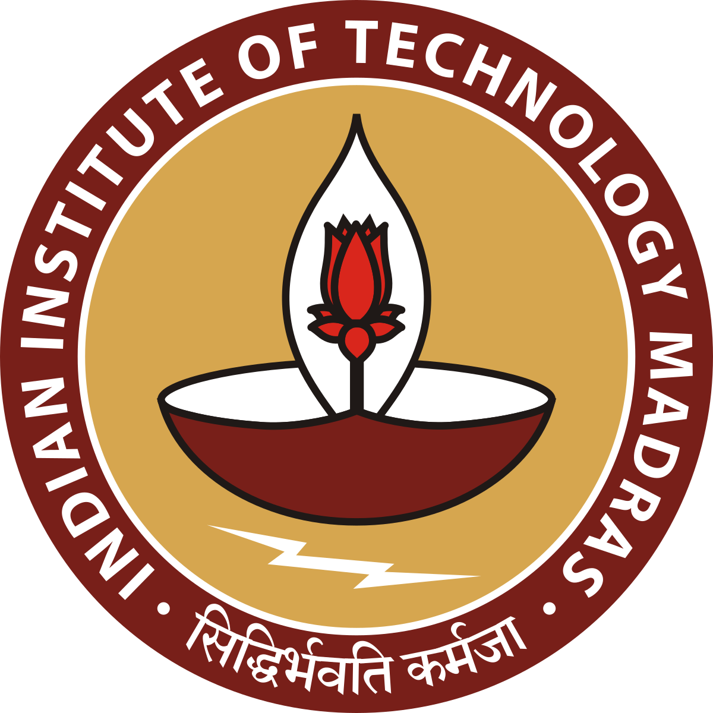
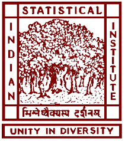
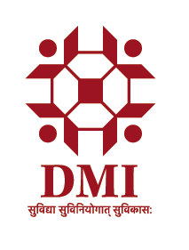
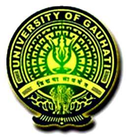

# Anurag Prasad

<!-- Removed page-local export bar; handled by global header injection -->

> Data & quantitative systems engineer: building ingestion, backtesting and research acceleration layers that turn noisy market & web feeds into reliable, strategy-ready intelligence.

---
## Professional Summary
Data professional with 1.5+ years of hands-on experience in financial data engineering & quantitative analytics. I design scalable historical + real-time ingestion & transformation pipelines (options + equities), optimize backtesting fidelity, and build lean automation / GenAI tooling that turns raw market data into actionable strategy insights. Bias for lean, observable, extensible systems.

---
## Core Competencies
- ⚡ Data Collection & Engineering — Large-scale real-time data collection, cleaning, processing, transformation & storage/caching (captured real-time options snapshot data at ~13ms latency); building scalable, robust crawlers/scrapers (dynamic sites; BrightData clients + experiments); market/options data normalization & replay.
- ⚡ MLOps & Analytics — End-to-end MLOps workflows (MLflow, Databricks patterns, DVC) emphasizing reproducibility (Google MLOps L0–L2 alignment); predictive/NLP model development with optimization loops.
- ⚡ GenAI & Automation — GenAI augmentation for artifact generation & research acceleration (DSPy, LangChain, LiteLLM, Bedrock) + prompt tooling automation.
- ⚡ Backtesting & Research Enablement — Architecture refactors for simulation fidelity, profiling, reproducibility; modular surfaces for faster hypothesis turnover.
- ⚡ Cloud & Infrastructure Automation — AWS wrappers (EC2, S3, IAM, CloudWatch) for robust orchestration, monitoring & resilient recovery; near zero manual intervention.

<!--
## Core Competencies (old table)
| Domain | Focus | Illustrative Outcomes |
|--------|-------|-----------------------|
| Market Data Engineering | Concurrent ingestion pipelines | Stable low-latency options capture w/ recovery hooks |
| Quant Research Enablement | Modular backtesting surfaces | Faster hypothesis turnover, cleaner factor isolation |
| Automation & Ops | AWS wrappers, monitoring, resilience | Reduced manual babysitting of long-running jobs |
| GenAI Tooling Integration | DSPy / LangChain / LiteLLM | Accelerated strategy ideation + artifact generation |
| Data Quality & Validation | Schema harmonization, profiling | Higher confidence in downstream analytics & backtests |
-->

<!--

<strong>Detailed Competencies (expanded)</strong>

- **Data Collection & Engineering** – Large-scale real-time data collection, cleaning, processing, transformation & storage/caching (captured real-time options snapshot data at ~13ms latency); building scalable, robust crawlers/scrapers (dynamic sites; BrightData clients + experiments); market/options data normalization & replay.
- **MLOps & Analytics** – End-to-end MLOps workflows (MLflow, Databricks patterns, DVC) emphasizing reproducibility (Google MLOps L0–L2 alignment); predictive/NLP model development with optimization loops.
- **GenAI & Automation** – GenAI augmentation for artifact generation & research acceleration (DSPy, LangChain, LiteLLM, Bedrock) + prompt tooling automation.
- **Backtesting & Research Enablement** – Architecture refactors for simulation fidelity, profiling, reproducibility; modular surfaces for faster hypothesis turnover.
- **Cloud & Infrastructure Automation** – AWS wrappers (EC2, S3, IAM, CloudWatch) for robust orchestration, monitoring & resilient recovery; near zero manual intervention.

-->

---
## Technical Stack
| Category | Tools |
|----------|-------|
| Languages | Python · R · C/C++ |
| Frameworks | FastAPI · Streamlit · Playwright · Scrapy · Selenium |
| Data / Compute | Pandas · NumPy · MLflow · DSPy · LangChain |
| Cloud / Infra | AWS (EC2, S3, IAM, CloudWatch, Bedrock) |
| Datastores | MySQL · MongoDB |
| Market Data APIs | Alpaca · Databento (REST / RTC) |
| Tooling & Ops | Git · CI/CD · Pytest · tmux · BrightData |

<strong>Bullet View</strong>

- **Languages:** Python, R, C/C++  
- **Frameworks:** FastAPI, Streamlit, Playwright, Scrapy, Selenium  
- **Data / Compute:** Pandas, NumPy, MLflow, DSPy, LangChain  
- **Cloud / Infra:** AWS (EC2, S3, IAM, CloudWatch, Bedrock)  
- **Datastores:** MySQL, MongoDB  
- **Market Data:** Alpaca, Databento (REST / RTC)  
- **Tooling & Ops:** Git, CI/CD, Pytest, tmux, BrightData  

  

---
## Experience
### ZfenseLabs Inc — Data Scientist (Finance) (Contract)
*Remote, CA | Jun 2024 – Present*

- Re-architected core options & equities backtesting components improving simulation fidelity + maintainability.
- Built concurrent historical + live options data pipelines (Alpaca REST, Databento RTC) on lean EC2 footprints.
- Developed GenAI research tooling (DSPy, LiteLLM, Bedrock, LangChain) for strategy prototyping & artifact automation.
- Authored reusable AWS automation wrappers (S3, EC2, CloudWatch) for monitoring & resilient session recovery.
- Instituted CI/CD, test harnesses, and performance profiling across analytics stack.

### BVPL — Data Analyst Intern
*Gurugram | Oct 2024 – Jan 2025*

- Delivered 100+ scalable PDP / Review / SERP crawlers with resilient selector strategies (XPath hardening).
- Standardized validation & automation flows reducing crawler maintenance overhead and boosting throughput.
- Built LLM-powered resume parser (MongoDB persistence) + assisted in data cleaning & QA workflows.

### SRIJAN — Project Executive MIS/IT
*New Delhi | Jul 2021 – Feb 2022*

- Produced modular MIS components; automated validation + multi-program reporting.
- Managed relational data assets & real-time dashboards (Google Data Studio) for stakeholders.
- Led trainings and maintained organizational web assets.

---
## Selected Impact Highlights
| Area | Impact |
|------|--------|
| Backtesting | Improved fidelity + modularity of simulation engine |
| Data Pipelines | Concurrent ingestion for high-volume options datasets |
| GenAI Enablement | Faster strategy ideation via AI-assisted tooling |
| Automation | Reusable AWS orchestration wrappers with recovery |
| Quality & Ops | CI + test harness + profiling integration |

---
## Education
| Program (Specialization) | Institution | Period |
|--------------------------|-------------|--------|
| BS – Data Science & Applications |  IIT Madras | 2025–Present [ONLINE] |
| PGD – Statistical Methods & Analytics |  Indian Statistical Institute | 2023–2024 |
| MDP – Project Management for Rural Livelihoods |  IRMA | 2021 |
| PGDM – Development Management |  Development Management Institute | 2018–2020 |
| B.Tech – Computer Science & Engineering |  Gauhati University | 2012–2016 |

---
## Certifications & Workshops
- Data Science Math Skills (Duke University, Coursera)
- India Data Portal Workshop (Bharti Institute of Public Policy)
- T4D: Digital Data Collection for Monitoring & Evaluation (FICCI Aditya Birla CSR Centre)

---
## Publications
Articles (OpenGenus IQ):
- [Pandas DataFrame (Complete Guide)](https://iq.opengenus.org/pandas-dataframe/)
- [Concept of Multiple Instance Learning](https://iq.opengenus.org/multiple-instance-learning/)

---
## Current Focus
- Experimenting with the traditional Black-Scholes Model (BSM) until it breaks
- Researching optimization techniques for Non-Integer Programming (NIP)
- Practicing advanced data structures in C

---
## Collaboration
Open to freelance contracts or data / quant / automation-focused projects. Happy to help bid & deliver high-quality outcomes.

---
## Contact
_For direct contact use the social icons in the footer or request email access._

---
<small>Last updated: September 2025 · This page intentionally replaces standalone resume & portfolio pages. Use the Download PDF button (print stylesheet optimized).</small>
